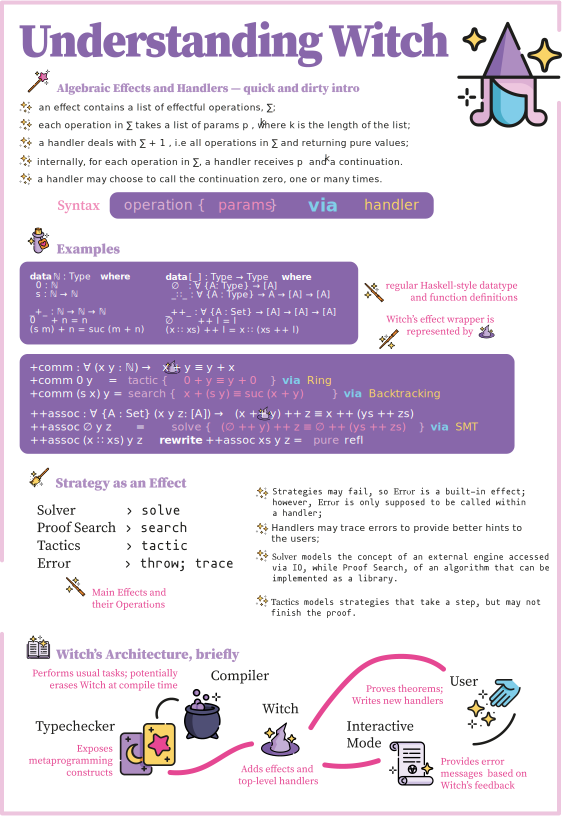

## Overview

Witch combines different proof strategies to enable users to profit from proof assistants without an in-depth understanding of the theory behind it. 
We define a witch as an assistive tool for theorem provers which congregates many different strategies for proof automation. Our specification for a witch for [Juvix](https://juvix.org/) uses algebraic effects and handlers as the means of congregation.

To learn more about Witch please consult the [academic paper](https://github.com/metastatedev/witch/blob/master/paper/main.pdf) or read this [introduction](https://research.metastate.dev/an-introduction-to-witch/) 

